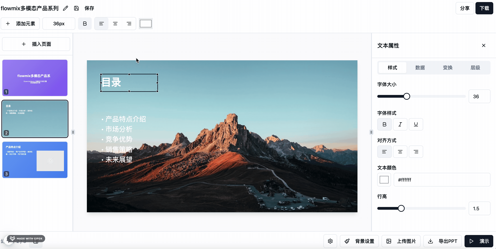

# pptx
A PPT online editor based on the web terminal ｜ 一款基于web端的ppt在线编辑器

项目完全开源，开源不易，可以点个【star】支持一下哦～

## 技术栈

- Nextjs
- @radix-ui
- tailwindcss
- html2canvas
- recharts
- 自研PPT结构转换算法

## 功能模块

- 多组件支持（图文，形状，表格，可视化图表等）
- 自定义画布
- 动态可配置属性面板
- PPT演示功能
- 组件可视化拖拽
- PPT导出功能

关注【趣谈前端】公众号，获取更多技术干货，项目最新进展，和开源实践。

## 在线办公相关解决方案

1. [flowmix/docx多模态文档编辑器](https://flowmix.turntip.cn)
2. [灵语AI文档](https://mindlink.turntip.cn)
3. [H5-Dooring智能零代码平台](https://github.com/MrXujiang/h5-Dooring)
